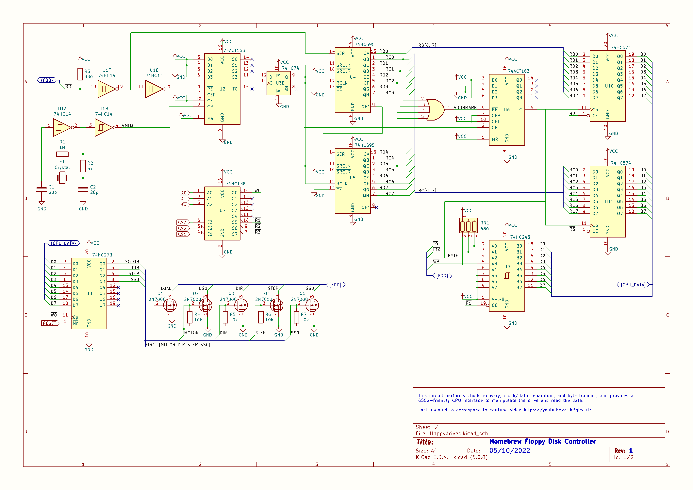

# Floppy Disc interface for 6502

<!-- -->

# Source code

The source code is in the src folder and can be compiled through the Makefile, or
by running something like:

    vasm.vasm6502-oldstyle -Fbin -dotdir src/floppytest.s -o bin/floppytest.out

Some of the library files were copied from simplevga6502 to provide an
environment to test in.

# Hardware schematics

To follow

# Test program

'floppytest' activates the drive and moves the head around in various patterns,
while printing some diagnostics on the screen.

# Feedback

Do let me know if you have any comments, questions, requests, or other feedback!  

